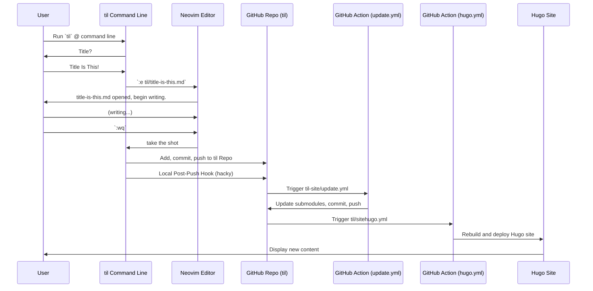

This weekend I've been ~~procrastinating~~ playing the long game by getting some nice workflows set up for my [TIL content repository](https://github.com/hiAndrewQuinn/til) and its associated [website](https://github.com/hiAndrewQuinn/til-site) (cf [Context](#context), below). If all goes well, by the time I hit `:wq` on this TIL, it should invisibly trigger 2 Git commits, a Hugo build, and then appear on the site fully-birthed.

One of the more interesting patterns I noticed was the [`.nojekyll` empty file](https://github.blog/2009-12-29-bypassing-jekyll-on-github-pages/) which I had to build to get GH Pages to stop tussling with my Hugo Action for turf. `.nojekyll` is *technically* a dotfile, but it doesn't actually contain any content - its mere existence is enough to change behavior. And that makes their existence a really interesting [design affordance](https://en.wikipedia.org/wiki/Affordance) offered to us developers by the filesystems we use every day but rarely think about.

Some other examples I've seen:

- `.gitkeep` is [by long convention](https://stackoverflow.com/a/8418403) often created inside of folders which we want to exist in Git, but which have nothing in them yet. `.gitkeep` doesn't actually need any text at all in it.
- Two of the projects I lead [at work](https://www.teleste.com/) use empty dotfiles in `/etc/opt` called things like `is_sheared` and `is_god` to perform some pretty wide-sweeping visual changes on system startup. It's a little hacky, but it's also really easy to explain (and script around): "If this file exists and you reboot the device, it starts in God mode."

I propose calling these kinds of files **dotflags**, to make it explicit that they are intended to be explicitly empty (or at best that their content is irrelevant). It's worth noticing as well that **all 3 examples are hacks** to varying degrees -- 2 of them come from the needs of for-profit corporations, and one of them is a hack by people who just want to keep a directory structure in Git and get on with their day.

## Context

The full workflow of what I'm trying to do in SVG form, as a [sequence diagram](https://jessems.com/posts/2023-07-22-the-unreasonable-effectiveness-of-sequence-diagrams-in-mermaidjs):

[](https://mermaid-js.github.io/mermaid-live-editor/edit#pako:eNp9lMtu2zAQRX9lypUDWDLqpRZpg6aICwRFkMdOC9HiVBpYIhWRrCEE-fcO9Uptq_XGouZczujySm8iNwpFIiy-etQ53pIsWlmnGvjXyNZRTo3UDl4stiBt_39Z_WbqWmoVAEfVvLwnjZfwd0XO9Jv9RPOb6vHGJfiIjQnYHbmd3w_LFe9_dYne7W5yR0Z__osf7sDKN0o6jLv6f8LtgrD0hfmHbMelJ3IYVOEawiLVAxg8iq6vRxcSePQaMp47g6-Qj9ZUszUjxoKgS-CZXIVflnfqa_DDwnNJ9tO5fvAxgSzBcAwbF-iIbOSYjmuVDYIBm_udU2Aa1KjWsMeCNBxbcqSL-GSgqdNqqsbx1SKQJcfX87bz0zh54EFLBFsad_4w4bQTuFE8SPCM3Boab0twpo9YKC9L7k0uK3gw1kUPQbAz5sBnKfNDN84YOMbnzLCvLRUFB5x3jiyf5OYjM4NkZuc2Lz0B1u9ro3yF9nTOxU7bk06b0GnK2GmbLYumiHF-cO-p4reLc6OwqUw3ZM72mQu6iZ0P9ZZsU8kONB55LO1Qs8FiLWpsa0mK3_i3oEwF219jKhK-VLI9pCLV78xJ78xTp3ORuNbjWgx-jF8HkfySlcX3P7Kpbc8)

And the associated [Mermaid](https://mermaid-js.github.io/mermaid-live-editor/edit#) code for the above diagram:

1. I run `til` at the command line.
2. I get prompted for a `Title`.
3. After I enter a `Title`, a Neovim window immediately opens up with properly-formatted frontmatter for me to type my TIL in one go.
4. After I `:wq`, the file is immediately added, committed, and pushed to https://github.com/hiAndrewQuinn/til.
5. A local [post-push hook](../no-such-thing-as-a-post-push-hook/) (Git commit [here](https://github.com/hiAndrewQuinn/til/commit/7296b8a8d5d19b88616def81b2f47ce11acf7fac)) runs immediately after this push, and triggers a Github Action on https://github.com/hiAndrewQuinn/til-site called [update.yml](https://github.com/hiAndrewQuinn/til-site/blob/main/.github/workflows/update.yml).
6. update.yml pulls the latest commits for til-site's Git submodules (currently only two -- the theme, and `til` itself, which populates the content/posts folder). That itself forms a Git commit, which immediately gets added, committed, and pushed to `til-site`.
7. A SECOND Github Workflow called [hugo.yml](https://github.com/hiAndrewQuinn/til-site/blob/main/.github/workflows/hugo.yml) is triggered by this `til-site` commit, and rebuilds and deploys the Hugo site.
8. The Hugo site gets the new content!
